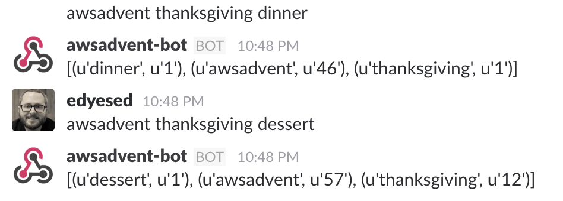

# aws_advent_2016

## Intro
This article will introduce you to creating serverless pubsub microservices by building a simple Slack based word counting service.


## Lambda Overview
These microservices are [AWS Lambda](https://aws.amazon.com/lambda/) based.  Lambda is service that does not require you to manage servers in order to run code.  The high level overview is that you define events ( called *triggers* ) that will cause a packaging of your code ( called a *function* ) to be invoked.  Inside your package ( aka *function* ), a specific function within a file ( called a *hander* ) will be called. 

If you're feeling a bit confused by terminology that you're familiar with being used to describe something that isn't your mental picture for those words, *you are not alone*. For now, here's the short list:

| Lambda word | More common name | long description |
| ----- | ---- | ----- |
| Trigger | AWS Service | Component that is terminating user-input, and causing our lambda to run | 
| Function | software package |  group of files needed to run some code. Libraries included | 
| handler | file.function in your package | This is a specific software function inside one file in your package |
     

There are many different types of triggers ( S3, API Gateway, kinesis streams ).  Lambdas run with a specific [IAM Role](https://aws.amazon.com/iam/faqs/#iam_role_management_anchor). This means that in addition to whatever power is brought to your purpose by your language of choice ( python, nodejs, java, scala ), you can call from your language to other AWS Services ( like DynamoDB ).


## Intro to these microservices

These microservices are going to count words typed into slack. The services are:
1. The first service splits up the user-input into individual words.
   It also adds a count of 1 to each of those words.
   It also supplies a response to the user showing the current count of any seen words.
   It acts as a trigger to functions 2 and 3 which will run concurrently.
   It ends.
   
1. The second service also splits up the user-input into individual words.
   It also adds a count of 10 to each of those words.
   It ends.

1. The third service logs the input it receives.
   It ends.

While you might not have a specific need for a word counter, the concepts demonstrated here could be used for other processes.  Say, you need to run several things in series, or perhaps you have a single event that needs to trigger concurrent workflows.

For example:
     * Concurrent workflows triggered by a single event:
          * New user joins org, and needs accounts created in several systems
          * Website user is interested in a specific topic, and you want to curate additional content to present to the user
          * There is a software outage, and you need to update several system ( statuspage, nagios, etc ) at the same time.
          * Website Clicks need to be tracked in a system used by Operations, and a different system used by Analytics
     * Serial workflows triggered by a single event:
          * New user needs a google account created, then that google account needs to be given permission to access another system integrated with google auth.
          * A new version of software needs to be packaged, then deployed, then activated
          * Cup is inserted to a coffee machine, then the coffee machine dispenses coffee into the cup.


* The API Gateway ( *trigger* ) will call a Lambda Function that will split whatever text it is given into specific words
      * Upsert a key in a DynamoDB table with the number 1
      * Drop a message on a SNS Topic
* The SNS Topic ( *trigger* ) will have two lambda functions attached to it that will
      * upsert the same keys in the dynamodb with the number 10
      * log a message to CloudWatchLogs

It looks like this picture here 

Example code for AWS Advent near-code-free pubsub. 
Technologies you'll use
* Slack  ( outgoing webhooks )
* API Gateway
* IAM
* SNS
* Lambda
* DynamoDB

# Pub/Sub is teh.best.evar* ( *for some values of best )
I came into the world of computing by way of *The Operations Path*.  The [Publish-Subscribe Pattern](https://en.wikipedia.org/wiki/Publish%E2%80%93subscribe_pattern) has always been near and dear to my ❤️. 

There are a few things about pubsub that I really appreciate as an "infrastructure person". 

1. **Scalability**. In terms of the transport layer ( usually a message bus of some kind ), the ability to scale is separate from the publishers and the consumers. In this wonderful thing which is AWS, we as infrastructure admins can get out of this aspect of the business of running pubsub entirely.

1. **Loose Coupling**. In the happy path, publishers don't know anything about what subscribers are doing with the messages they publish.  There's admittedly a little hand-waving here, and folks new to pubsub (and sometimes those that are experienced ) get rude suprises as messages mutate over time.

1. **Asynchronous**. This is not necessarily inherent in the pubsub pattern, but it's the most common implementation that I've seen.  There's quite a lot of pressure that can be absent from Dev Teams, Operations Teams, or DevOps Teams when there is no expectation from the business that systems will retain single millisecond response times.

1. **New Cloud Ways**. Once upon a time, we needed to queue messages in pubsub systems ( and you might you might still have a need for that feature ), but with Lambda, we can also invoke consumers _on demand_ as messages pass through our system. We don't have necessarily keep things in the queue at all. Message appears, processing code runs, everybody's happy.

# Yo dawg, I heard you like ️☁️
One of the biggest benefits that we can enjoy from being hosted with AWS is *not having to manage stuff*.  Running your own message bus might be something that separates your business from your competition, but it might also be _undifferentiated heavy lifting_.  

IMO, if AWS can and will handle scaling issues for you ( to say nothing of only paying for the transactions that you use ), then it might be the right choice for you to let them take care of that for you.

I would also like to point out that running these things without servers isn't quite the same thing as running them simply.  I ended up redoing this implementation a few times as I kept finding the rough edges of running things serverless. All were ultimately addressable, but I wanted to keep the complexity of this down somewhat.


# WELCOME TO THE FUTURE, FRIENDS
`TL;DR` GIMMIE SOME EXAMPLES

CloudFormation is pretty well covered by [AWS Advent](http://awsadvent.tumblr.com), we'll configure this little diddy via the AWS console. 


# TO THE ~~BAT~~CODE CAVE! 
## Setup the first lambda, which will be linked to an outgoing webhook in slack
### Setup the DynamoDB 

👇 You can follow the steps below, or view  this video 👉 [](https://youtu.be/ww3aSExgkRM "Make a DynamoDB")

1. Console  
1. DynamoDB
1. Create Table
    1. Table Name `table`
    1. Primary Key `word`
    1. `Create`

### Setup the First Lambda 

This lambda accepts the input from a slack outgoing webhook, splits the input into separate words, and adds a count of one to each word. It further returns a json response body to the outgoing webhook that displays a message in slack. 

If the lambda is triggered with the input `awsadvent some words`, this lambda will create the following three keys in dynamodb, and give each the value of one.
     * **awsadvent** = **1**
     * **some** = **1**
     * **words** = **1**

👇 You can follow the steps below, or view  this video 👉 [](https://youtu.be/7gkmqYd6v8w "Make The First Lambda to accept outgoing slack webhooks")

1. Make the first lambda, which accepts slack outgoing webook input, and saves that in DynamoDB
    1. Console
    1. lambda
    1. Get Started Now
    1. Select Blueprint
        1. Blank Function
    1. Configure Triggers
        1. Click in the empty box
        1. Choose API Gateway
    1. API Name
        1. `aws_advent` ( This will be the /PATH of your API Call )
    1. Security
        1. Open 
    1. Name
        1. `aws_advent`
    1. Runtime
        1. Python 2.7
    1. Code Entry Type
        1. Inline
        1. It's included as [app.py](src/aws_advent_apigw_dynamo_sns/app.py) in this repo. [There are more Lambda Packaging Examples here](http://docs.aws.amazon.com/lambda/latest/dg/vpc-ec-deployment-pkg.html)
    1. Environment Variables
        1. `DYNAMO_TABLE` = `table`
    1. Handler
        1. `app.handler`
    1. Role
        1. Create new role from template(s)
        1. Name
            1. `aws_advent_lambda_dynamo`
    1. Policy Templates
        1. Simple Microservice permissions
    1. Triggers
        1. API Gateway
        1. **save the URL**

        
### Link it to your favorite slack 

👇 You can follow the steps below, or view  this video 👉 [](https://youtu.be/fnt78n2tvak "Setup the slack outgoing webhook")
1. Setup an outbound webhook in your favorite slack team.
    1. Manage
    1. search
        1. outgoing wehbooks
    1. channel ( optional )
    1. trigger words
        1. awsadvent
    1. URLs
        1. Your API Gateway Endpoint on the lambda from above
    1. Customize Name
        1. awsadvent-bot

1. Go to slack
     1. join the room
     1. say the trigger word
     1. You should see something like 👉 


## ☝️☝️ CONGRATS YOU JUST DID CHATOPS ☝️☝️

*** 


# Ok. now we want to do the awesome pubsub stuff
### Make the SNS Topic
We're using a SNS Topic as a broker. The **producer** ( the `aws_advent` lambda ) publishes messages to the SNS Topic.  Two other lambdas will be **consumers** of the SNS Topic, and they'll get triggered as new messages come into the Topic.

👇 You can follow the steps below, or view  this video 👉 [](https://youtu.be/ZB2Y-fEIYJ0 "Setup the SNS Topic")
1. Console
1. SNS
1. New Topic
1. Name `awsadvent`
1. ***Note the topic ARN***
           

### Add additional permissions to the first lambda
This permission will allow the first lambda to talk to the SNS Topic. You also need to set an environment variable on the `aws_advent` lambda to have it be able to talk to the SNS Topic. 

👇 You can follow the steps below, or view  this video 👉 [](https://youtu.be/b9cXoz6e8zA "Setup the SNS Topic")

1. Give additional IAM permissions on the role for the first lambda
     1. Console
     1. IAM
     1. Roles `aws_advent_lambda_dynamo`
         1. Permissions
         1. Inline Policies
         1. click here
         1. Policy Name
         1. `aws_advent_lambda_dynamo_snspublish`

```javascript
{
   "Version":"2012-10-17",
   "Statement":[{
      "Effect":"Allow",
      "Action":"sns:Publish",
      "Resource":"arn:aws:sns:*:*:awsadvent"
      }
   ]
}

```


### Add the SNS Topic Arn to the aws_advent lambda
👇 You can follow the steps below, or view  this video 👉 [](https://youtu.be/k_7KnVi9jy8 "Adding a new environment variable to the lambda")

There's a conditional in the `aws_advent` lambda that will publish to a SNS topic, if the SNS_TOPIC_ARN environment variable is set. Set it, and watch more pubsub magic happen.

1. Add the *SNS_TOPIC_ARN* environment variable to the `aws_advent` lambda
     1. Console
     1. LAMBDA
     1. `aws_advent`
     1. Scroll down
     1. `SNS_TOPIC_ARN`
         1. The SNS Topic ARN from above.

### Create a consumer lambda: `aws_advent_sns_multiplier`
This microservice increases the values collected by the `aws_advent` lambda. In a real world application, I would probably not take the approach of hanving a second lambda function update values in a database that are originally input by another lambda function. *It's useful here to show how work can be done outside of the Request->Response flow for a request.*  A less contrived example might be that this lambda checks for words with high counts, to build a leaderboard of words.

This lambda function will subscribe to the SNS Topic, and it is *triggered* when a message is delivered to the SNS Topic.  In the real world, this lambda might do something like copy data to a secondary database that internal users can query without impacting the user experience. 


👇 You can follow the steps below, or view  this video 👉 [](https://youtu.be/L4LeoxR5pV4 "Creating the sns multiplier lambda")

1. Console
1. lambda
1. Create a Lambda function
1. Select Blueprint
        1. search sns
        1. `sns-message` python2.7 runtime
1. Configure Triggers
   1. SNS topic
        1. `awsadvent`
        1. click `enable trigger`
1. Name
    1. `sns_multiplier`
1. Runtime
    1. Python 2.7
1. Code Entry Type
    1. Inline
        1. It's included as [sns_multiplier.py](src/sns_multiplier/sns_multiplier.py) in this repo.
1. Handler
    1. sns_multiplier.handler
1. Role
    1. Create new role from template(s)
1. Policy Templates
   1. Simple Microservice permissions
1. Next
1. Create Function

### Go back to slack and test it out. 
Now that you have the most interesting parts hooked up together, test it out!

What we'd expect to happen is pictured here 👉 

👇 Writeup is below, or view  this video 👉 [](https://youtu.be/e41IDKFO8dI "Watch it work")


* The first time we sent a message, the count of the number of times the words are seen is one. This is provided by our first lambda
* The second time we sent a message, the count of the number of times the words are seen is twelve. This is a combination of our first and second lambdas working together. 
     1. The first invocation set the count to `current(0) + one`, and passed the words off to the SNS topic.  The value of each word in the database was set to **1**.
     2. After SNS recieved the message, it ran the `sns_multiplier` lambda, which added ten to the value of each word `current(1) + 10`. The value of each word in the database was set to **11**.
     2. The second invocation set the count of each word to `current(11) + 1`.  The value of each word in the database was set to 12.


## Now you're doing pubsub microservices
### Setup the logger lambda as well
This output of this lambda will be viewable in the CloudWatch Logs console, and it's only showing that we could do something else ( anything else, even ) with this microservice implementation.

1. Console
1. lambda
1. Create a Lambda function
1. Select Blueprint
        1. search sns
        1. `sns-message` python2.7 runtime
1. Configure Triggers
   1. SNS topic
        1. `awsadvent`
        1. click `enable trigger`
1. Name
    1. `sns_logger`
1. Runtime
    1. Python 2.7
1. Code Entry Type
    1. Inline
        1. It's included as [sns_logger.py](src/sns_logger/sns_logger.py) in this repo.
1. Handler
    1. sns_logger.handler
1. Role
    1. Create new role from template(s)
1. Policy Templates
   1. Simple Microservice permissions
1. Next
1. Create Function


# In conclusion
PubSub is an awsome model for some types of work, and in AWS with Lambda we can work inside this model relatively simply.  Plenty of real-word work depends on the pub-sub model. 

You might translate this project to things that you do need to do like software deployment, user account management, building leaderboards, etc.

## AWS + Lambda == the happy path
*It's ok to lean on AWS for the heavy lifting.* As our word counter becomes more popular, we probably won't have to do anything at all to scale with traffic.  Having our code execute on a request driven basis is a big win from my point of view.  "Serverless" computing is a very interesting development in cloud computing.  Look for ways to experiement with it, there are benefits to it ( other than novelty ).

Some benefits you can enjoy via Servless PubSub in AWS:
1. Scaling the publishers.
   Since this used API Gateway to terminate user requests to a Lambda function:
      1. You don't have idle resources burning money, waiting for traffic
      1. You don't have to scale because traffic has increased or decreased
1. Scaling the bus / interconnection.
   SNS did the following for you:
      1. Scaled to accomodate the volume of traffic we send to it
      1. Provided HA for the bus
      1. Pay-per-transaction. You don't have to pay for idle resources!
1. Scaling the consumers.
   Having lambda functions that *trigger* on a message being delivered to SNS
      1. Scaled the lambda invocations to the volume of traffic.
      1. Provides some sense of HA 

## Lambda and the API Gateway are works in progress.
Lambda is a new technology. If you use it, you will find some rough edges.

The API Gateway is a new technology. If you use it, you will find some rough edges.

Don't let that dissuade you from trying them out!

I'm open for further discussion on these topics. Find me on twitter [@edyesed](https://twitter.com/edyesed)
